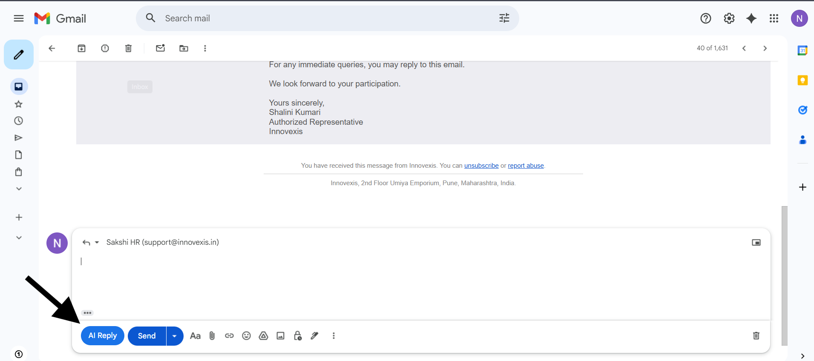
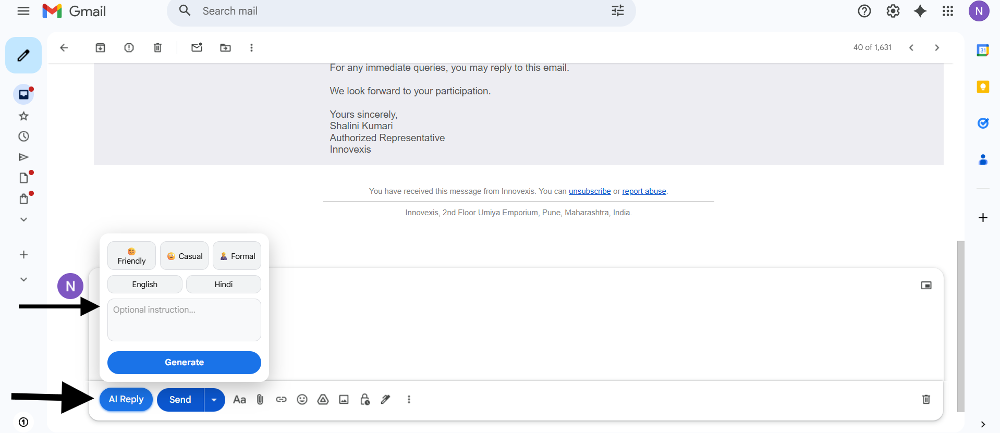
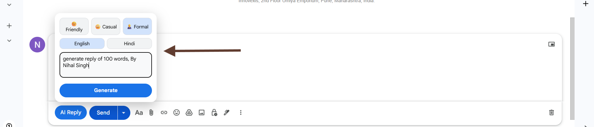
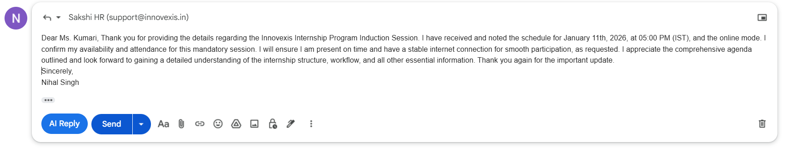

#  📧 Smart Mail AI – Gmail Extension


  

## 📌 Project Overview
  Smart Mail AI  is a Chrome Extension backed by a Spring Boot API that automatically generates professional email replies using Google Gemini AI.

It integrates directly inside Gmail and allows users to:
- Generate AI replies with one click
- Choose tone (Formal, Casual, Friendly)
- Add custom instructions
- Generate replies in English or Hindi
- Save time while writing professional emails

The project demonstrates real-world use of AI APIs, Chrome Extensions, and backend integration.

## ✨ Features

### 🚀 AI-Powered Email Reply
- Generates intelligent email replies using **Google Gemini AI**
- Produces human-like, context-aware responses
- Works directly inside Gmail compose window

### 🎯 Multiple Tone Options
- **Formal** – for professional communication  
- **Casual** – for relaxed conversations  
- **Friendly** – warm and polite responses  

### 📝 Custom Prompt Support
- Add custom instructions like:
  - “Reply politely”
  - “Make it short”
  - “Ask for a meeting”
- AI adapts response based on user input

### 🌐 Language Support
- Generate replies in:
  - **English**
  - **Hindi**

### ⚡ One-Click Integration
- AI Reply button appears directly in Gmail
- No need to copy-paste emails
- Instant reply generation

### ✨ Clean & Interactive UI
- Dropdown-based tone selector
- Smooth hover effects
- Modern UI matching Gmail’s design

### 🔐 Secure Backend
- Built using **Spring Boot**
- API key secured in backend
- No API keys exposed in frontend

### 🧠 Smart Prompt Engineering
- Dynamically constructs prompts
- Handles tone, language, and intent accurately
- Optimized for Gemini AI responses

### 🧩 Modular Architecture
- Clean separation of:
  - Frontend (Chrome Extension)
  - Backend (Spring Boot)
  - AI Integration Layer

---


## 🛠 Tech Stack

### 🔹 Frontend (Chrome Extension)
- **JavaScript (ES6+)**
- **HTML5 / CSS3**
- **Chrome Extension APIs**
- **MutationObserver** (for Gmail DOM detection)
- **Dynamic UI Injection**

### 🔹 Backend (API Server)
- **Java 17**
- **Spring Boot**
- **Spring WebFlux (Reactive APIs)**
- **RESTful API Architecture**

### 🔹 AI Integration
- **Google Gemini API**
- Custom prompt engineering
- Dynamic tone & language control


### 🔹 Tools & Platforms
- **Git & GitHub**
- **Postman** (API testing)
- **IntelliJ IDEA**
- **Chrome Developer Tools**

### 🔹 Architecture
- Client → Chrome Extension  
- Backend → Spring Boot API  
- AI Layer → Gemini API  
- Fully decoupled frontend & backend  

---


## ⚙️ How It Works

### 1️⃣ Gmail Detection
- The Chrome extension continuously monitors Gmail using a **MutationObserver**.
- When a **Compose window** is opened, the extension automatically injects an **AI Reply button** into the Gmail toolbar.

---

### 2️⃣ User Interaction
- User clicks the **AI Reply** button.
- A smart popup appears with:
  - 🎭 Tone selection (Friendly / Casual / Formal)
  - 🌐 Language selection (English / Hindi)
  - ✍️ Optional custom instruction input
- User clicks **Generate Reply**.

---

### 3️⃣ Data Sent to Backend
The extension sends a POST request to the Spring Boot backend:

```json
{
  "emailContent": "Original email text",
  "tone": "formal",
  "language": "english",
  "customPrompt": "Reply politely and briefly"
}
```


## 🚀 How to Run

This project consists of **two parts**:
  1. **Spring Boot Backend (AI Engine)**
  2. **Chrome Extension (Frontend UI)**

---

## 🧩 1. Backend Setup (Spring Boot)

### ✅ Prerequisites
- Java 17+
- Maven
- Google Gemini API Key
- Internet connection

---

### 🔹 Step 1: Clone Repository
```bash
git clone https://github.com/NIHAL29SINGH/Gmail-Extension---SpringBoot.git
cd Gmail-Extension---SpringBoot
```
## ✅ Step 2: Configure Backend (Spring Boot)

1. Open the following file:
src/main/resources/application.properties

2. Add your **Google Gemini API Key**:

```properties
gemini.api.key=YOUR_GEMINI_API_KEY
gemini.api.url=https://generativelanguage.googleapis.com
```
Save the file.

📌 Note:
Make sure your Gemini API key is active and has access to the Generative Language API in Google Cloud Console.
## ✅ Step 3: Run Backend (Spring Boot)

1. Open terminal in the backend project folder.

2. Run the Spring Boot application:

```bash
mvn spring-boot:run
```
 3. Wait until you see:
```bash
Tomcat started on port 8080
```
4. Backend will be available at:
```bash
http://localhost:8080
```


## ✅ Step 4: Load Chrome Extension

1. Open **Google Chrome**

2. Go to:

```text
chrome://extensions
```

3. Enable **Developer Mode** (top-right corner)

4. Click **Load unpacked**

5. Select the **extension folder**

6. Extension will be loaded successfully

---

## ✅ Step 5: Use the Extension

1. Open **Gmail**
2. Click **Compose**
3. You will see the **AI Reply** button near the Send button
4. Click **AI Reply**
5. Choose:

   * Tone (Friendly / Casual / Formal)
   * Optional custom instruction
6. Click **Generate**
7. AI-generated reply appears automatically in the email box

---


## 📸 Screenshots
---


### 🔹 Gmail Compose with AI Reply Button


---

### 🔹 Gmail Compose with AI Reply Button


---

### 🔹 Tone & Language Selection


---

### 🔹 Generated AI Reply


---
## 👨‍💻 Author
**Nihal Singh**  
Built as a personal project for learning and portfolio purposes.

© 2026 Nihal Singh. All rights reserved.

---

## 📄 License
This project is licensed under the **MIT License**.


